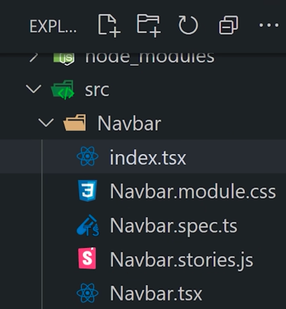

# Archivos sucios

A medida que nuestra aplicación crece, tambien lo harán nuestros archivos, por lo que estaremos buscando siempre la forma correcta de organizar el proyecto.

## Problema

La siguiente imagen muestra una forma incorrecta de lidiar con los archivos.

## Solución

### Un componente por archivo

- Si se va a exportar un componente, es conveniente que este viva en su propio archivo.

- En proyecto más grandes, es aconsejable dar un paso más allá y almacenar cada componente en su propio directorio, en el cual se guarde todo lo relacionado con el mismo.

